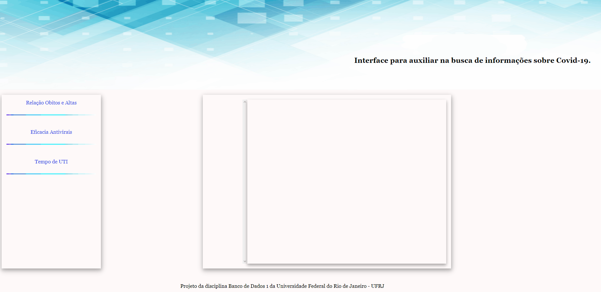

# Projeto final da disciplina Banco de Dados da Universidade Federal do Rio de Janeiro - UFRJ

## Descrição
 Neste projeto foi nos dados um exemplo do banco de dados usado  na Fundação Oswaldo Cruz (Fiocruz) e com as informações nele contidas criamos uma interface que auxiliasse o usuário a coletar informações sobre a covid-19. 

## Tecnologias
 :heavy_check_mark: PHP  
 :heavy_check_mark: Javascript  
 :heavy_check_mark: HTML  
 :heavy_check_mark: CSS  
 :heavy_check_mark: Canvasjs - Uma biblioteca do javascript para criação de gráficos  
 :heavy_check_mark: Mysql  

